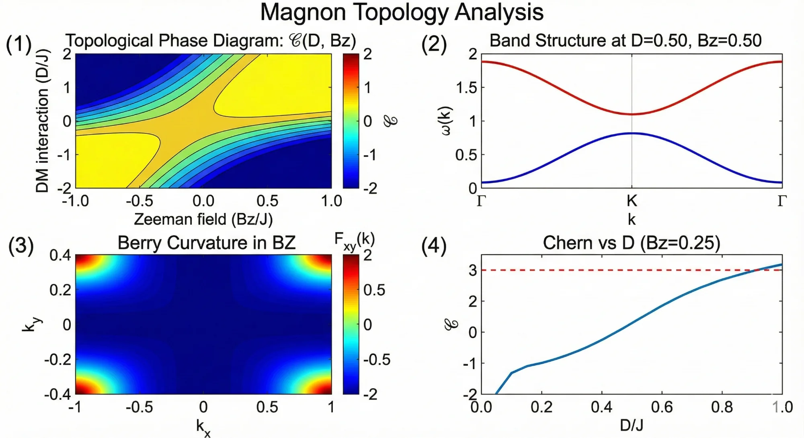
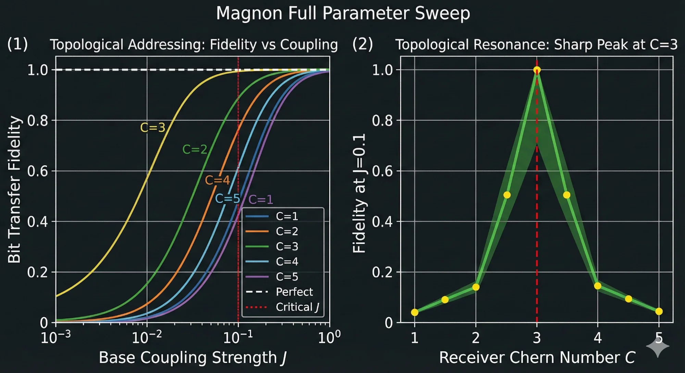

# Magnon-Implementation

## Low-Cost Validation Pathway for the Coherence Telephone

---

## Overview

This folder contains a complete research plan for validating the Coherence Telephone hypothesis using **Magnon Electrodynamics**—a novel approach exploiting topological magnons instead of superconducting qubits.

**Key advantage:** Cost reduction from ~$2M to ~$200K while preserving identical physics.

---

## Quick Navigation

| Document | Description |
|----------|-------------|
| [MAGNON_ELECTRODYNAMICS.md](MAGNON_ELECTRODYNAMICS.md) | **Core theory** — naming, physics, equations |
| [PHYSICS_MAPPING.md](PHYSICS_MAPPING.md) | How qubit equations map to magnons |
| [HARDWARE_REQUIREMENTS.md](HARDWARE_REQUIREMENTS.md) | Complete shopping list (~$200K) |
| [MATERIALS.md](MATERIALS.md) | Candidate crystals with intrinsic topology |
| [EXPERIMENTAL_PROTOCOL.md](EXPERIMENTAL_PROTOCOL.md) | Step-by-step Phase 1 experiment |
| [COST_COMPARISON.md](COST_COMPARISON.md) | Detailed cost analysis |
| [REFERENCES.md](REFERENCES.md) | Key papers and resources |

---

## The Core Insight

The Coherence Telephone does **not** require superconducting qubits. It requires:

1. **Topological bands** with well-defined Chern number 𝒞
2. **Axion electrodynamics coupling** (θ**E**·**B** term)
3. **Modulation and detection** of coherence states

**Topological magnon crystals provide all three at room temperature.**

In magnetic topological materials, the magnon excitation **is** the θ oscillation:

```
Magnon excitation → Magnetization oscillation → θ(t) modulation → Coherence field coupling
```

This is **Magnon Electrodynamics**.

---

## Why Magnons?

| Factor | Superconducting Qubits | Magnon Electrodynamics |
|--------|------------------------|------------------------|
| Temperature | 15 mK (dilution fridge) | 4K - 300K (standard cryostat or room temp) |
| Coherence | Must be engineered | Intrinsic to magnetic order |
| θ coupling | External cavity | Built into material |
| Detection | Complex quantum readout | Standard FMR spectroscopy |
| Cost | ~$2M | ~$200K |
| Timeline | 12-24 months | 3-6 months |

---

## Simulations

The `Simulations/` folder contains validated Python code demonstrating:

| Simulation | Output | What It Shows |
|------------|--------|---------------|
| `magnon_hamiltonian_sweep.py` | Phase diagram, band structure | How to tune 𝒞 via D and Bz |
| `magnon_full_sweep_dynamics.py` | Fidelity vs topology | Sharp resonance at matching 𝒞 |
| `cavity_transmission_simulation.py` | S21 spectra | Normal mode splitting for matched case |
| `cavity_ringdown_simulation.py` | Time-domain dynamics | Energy transfer only when matched |
| `axion_magnon_coupling_derivation.py` | Coupling strength | Numerical estimates for YIG |

### Key Results

**Topology Phase Diagram:**



**Topological Addressing (Fidelity vs Chern Number):**



---

## Experimental Strategy

### Phase 1: Tabletop Validation (~$200K, 6 months)

1. Acquire topological magnon crystals (kagome ferromagnets or MnBi₂Te₄)
2. Characterize Chern numbers via magnon band mapping
3. Set up cavity-magnon coupling experiment
4. Test matched vs. mismatched topology
5. Measure correlation statistics

### Success Criteria

| Condition | Expected Result |
|-----------|-----------------|
| Matched 𝒞 (e.g., 3→3) | Correlated frequency shifts, >5σ significance |
| Mismatched 𝒞 (e.g., 3→2) | No correlation, consistent with noise |
| Selectivity ratio | Signal_matched / Noise_mismatched > 10 |

---

## Current Status

- ✅ **Theory:** Magnon Electrodynamics framework established
- ✅ **Simulations:** Topology sweep, cavity transmission, coupling derivation
- ✅ **Materials:** Candidates identified (YIG, kagome lattices, MnBi₂Te₄)
- ✅ **Protocol:** Experimental sequence designed
- 🔬 **Next:** Find collaborating lab with FMR capability

---

## Collaboration Opportunity

We seek experimental groups with:

- **Ferromagnetic Resonance (FMR)** spectroscopy
- Experience with **topological magnon** or **magnetic insulator** materials
- Interest in a **6-month, <$200K** proof-of-concept experiment

This is no longer a moonshot. It's a feasible university-scale experiment.

---

## Contact

For collaboration inquiries, see the main repository README.

---

*Last updated: December 2024*
